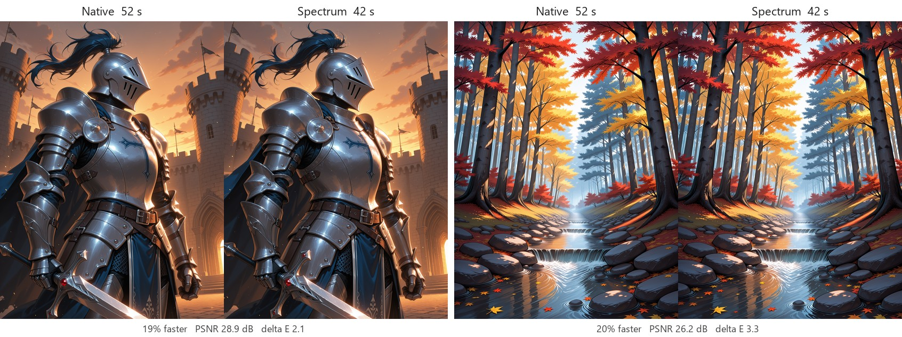
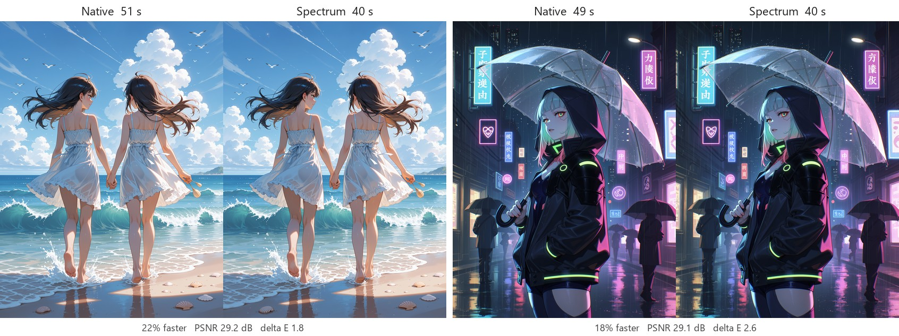
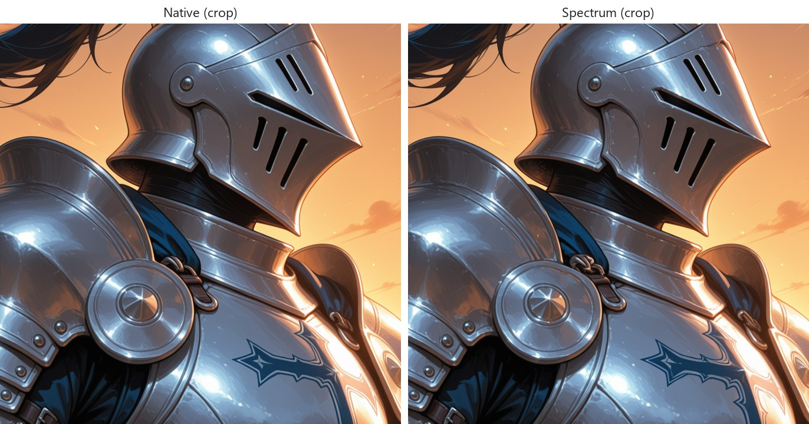

# Spectrum Anima v2

Faster sampling for **Anima** models in ComfyUI, with images that stay very close to normal sampling.

Spectrum skips the expensive part of the model on some steps and predicts its result from the steps around it. On a typical turbo-LoRA workflow that saves about **20% of the generation time**, while colors, contrast and composition stay the same as without it.




## Results

Same seed and settings with and without Spectrum, default node settings. Six different Anima finetunes, with no LoRA, one style LoRA or two style LoRAs, on varied prompts (knight, festival at night, autumn forest, library, beach, neon city). Measured at 1536x2048 on an RTX 2070 8 GB.

| Workflow | Faster | Closeness to native (PSNR) | Average color difference (delta E) | Brightness shift |
|---|---|---|---|---|
| Turbo LoRA + SPEED sampler + NAG, 16 steps | 20% | 29.4 dB | 2.2 | 0.2% |
| Turbo LoRA + SPEED sampler, 16 steps | 24% | 28.5 dB | 2.2 | 0.1% |
| Turbo LoRA + NAG, 16 steps | 17% | 30.2 dB | 2.1 | 0.2% |
| No turbo, 30 steps, CFG 8 | 10% | 29.3 dB | 2.9 | 0.1% |

- Composition, colors and contrast match normal sampling. Differences are in small details: a buckle, a strand of hair, the exact shape of a highlight.
- No washed-out colors: brightness, contrast and saturation stay within a fraction of a percent with turbo workflows.
- High CFG without a turbo LoRA amplifies prediction errors, so the defaults stay conservative there. `start_sigma` 0.8 makes that case about 23% faster but visibly changes images (22.5 dB, 3.7% brightness shift).
- Timings on a consumer GPU vary by several seconds between runs; the percentages are averages over all runs.



## Install

Clone into `ComfyUI/custom_nodes` and restart ComfyUI. No extra dependencies.

```
cd ComfyUI/custom_nodes
git clone https://github.com/Erehr/ComfyUI-Spectrum-Anima-v2
```

## Usage

Add **Spectrum Apply Anima v2** after your LoRAs and other model patches, right before the sampler:

```
Load Diffusion Model -> LoRAs -> (NAG) -> Spectrum Apply Anima v2 -> KSampler / SamplerCustom
```

The defaults are tuned for 16-30 step workflows and need no changes. Bypass the node to compare against normal sampling with the same seed.

Do not combine it with other step-skipping accelerators (TeaCache, FBCache and similar caches); they skip the same work.

## Settings

| Setting | Default | What it does |
|---|---|---|
| `blend_weight` | 0.5 | Mix between the long-range spectral predictor (1) and a short linear extrapolation (0). |
| `degree` | 4 | Complexity of the spectral predictor. |
| `ridge_lambda` | 0.25 | Smoothing of the spectral predictor. |
| `warmup_steps` | 4 | First steps that always run the full model. |
| `start_sigma` | 0.7 | Steps are only predicted once the noise level is at or below this. Early, noisy steps decide the composition. |
| `window_size` | 2 | One step in every `window_size` runs the full model. 2 = every other step. |
| `flex_window` | 0 | Grows the window during the run to predict more steps late. |
| `tail_actual_steps` | 3 | Last steps that always run the full model. Keep at least 2. |
| `min_fit_points` (advanced) | 1 | Full steps needed before predicting, counted again when the batch changes (for example when NAG stops). |
| `history_size` (advanced) | 16 | Full steps remembered for prediction. |
| `offload_history` (advanced) | on | Keep remembered steps in system RAM instead of VRAM. |

### Tuning

- **Closer to native:** `min_fit_points` 2 when using NAG, or `tail_actual_steps` 4. Each costs some speed.
- **Faster:** raise `start_sigma` to 0.8 (fine with turbo LoRAs and low CFG), or 0.9 to 1.0 to predict even earlier steps. This is the setting that most changes the image, especially without a turbo LoRA or at high CFG. It has no effect on SPEED workflows, whose predicted steps are already late.
- `blend_weight`, `degree` and `ridge_lambda` made almost no difference in testing; the defaults are fine.
- `window_size` 3 (two predicted steps in a row) was noticeably less faithful than 2.

## Compatibility

- **Models:** Anima and Anima finetunes. Other model families are not supported.
- **LoRAs and model patches:** work as usual; place Spectrum after them.
- **Samplers:** euler, euler_ancestral, euler CFG++ variants, lms, dpmpp_2m, dpmpp_2m_sde, dpmpp_3m_sde, ddpm, lcm, ipndm, deis, res_multistep, gradient_estimation, er_sde, sa_solver. Other samplers (heun, dpm_2, dpmpp_sde, uni_pc and so on) evaluate the model several times per step; with those the node runs normal sampling.
- **SPEED samplers** (spectral progressive diffusion, which samples the first steps at reduced resolution): supported. Steps at reduced resolution always run the full model, since they are cheap and decide the composition.
- **NAG:** supported. When NAG stops partway through, the following step runs the full model while the prediction re-adapts.
- **CFG:** positive and negative prompts are predicted separately.

## How it works

On a full step the node records the transformer's output just before the model's output layer. On a predicted step the transformer is skipped and that output is predicted from the recorded ones, with a Chebyshev polynomial fit blended with a linear extrapolation over the noise level. The model's own output layer then runs on the prediction with the current step's settings, which keeps colors and contrast intact.

The node tracks the sampler's real steps and runs the full model whenever anything is uncertain: an unsupported sampler, a change in resolution or batch layout, or a step outside the expected schedule.

## Acknowledgments

- [Spectrum: Adaptive Spectral Feature Forecasting for Diffusion Sampling Acceleration](https://github.com/hanjq17/Spectrum) (Han et al., CVPR 2026), the algorithm.
- [ComfyUI-Anima-Enhancer](https://github.com/AdamNizol/ComfyUI-Anima-Enhancer), the first Spectrum implementation for Anima this node grew from.
- [ComfyUI-Spectrum-Anima](https://github.com/Nif00/ComfyUI-Spectrum-Anima), the Anima integration point and protected final steps.
- [ComfyUI-Spectrum-Proper](https://github.com/xmarre/ComfyUI-Spectrum-Proper), [ComfyUI-Spectrum-SDXL-Proper](https://github.com/xmarre/ComfyUI-Spectrum-SDXL-Proper), [ComfyUI-Spectrum-WAN-Proper](https://github.com/xmarre/ComfyUI-Spectrum-WAN-Proper) and [ComfyUI-Spectrum-MiniMax-H3](https://github.com/xmarre/ComfyUI-Spectrum-MiniMax-H3), for step tracking, noise-level coordinates, fail-safe behavior and the low-VRAM predictor.
- [ComfyUI-Spectrum-KSampler](https://github.com/sorryhyun/ComfyUI-Spectrum-KSampler) and [ComfyUI-Spectrum-LTX](https://github.com/Gavr728/ComfyUI-Spectrum-LTX), for ideas that were compared during tuning.
- [ComfyUI-SPEED](https://github.com/ruwwww/ComfyUI-SPEED) and [SPEED](https://github.com/howardhx/speed), the progressive-resolution sampler tested alongside.
- [ComfyUI-Anima-NAG](https://github.com/hybskgks28275/ComfyUI-Anima-NAG), the NAG implementation tested alongside.
